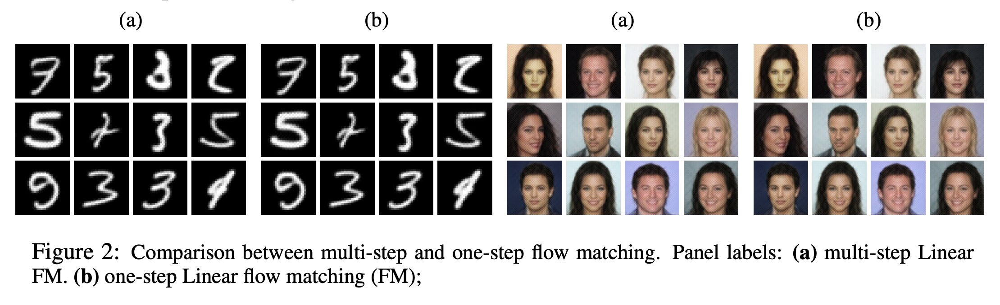
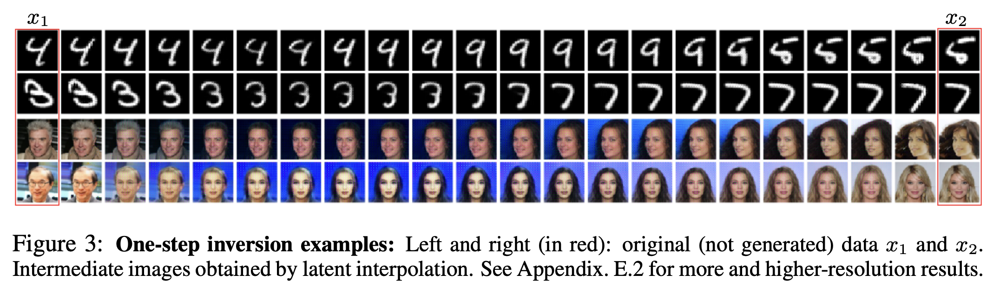

# One-Step Generation

## Overview

This application implements fast generative modeling using flow matching with linearized transformations made possible
by our **Linearezer framework**. It enables both one-step and multi-step generation,
along with unique inversion capabilities which we demonstrate though interpolation in the latent space.

## Training a Model

### Pre-trained Checkpoints - Coming Soon
Pre-trained checkpoints for **MNIST** and **CelebA** are available here:
- [Google Drive](https://drive.google.com/drive/folders/1gk3y8jv7Yk9X1JH5cX4Fqz4b2c3JH5cX?usp=sharing)

**How to use**
1. Download the ZIP from the Drive link.
2. Extract it to your desired directory.
3. Each checkpoint folder includes the exact training arguments and model weights.

**Folder structure**
```
├─ args.json
└─ models_directory
   └─ model.pth
```


- `args.json` - the arguments used to train the model.
- `models_directory/model.pth` - the pre-trained weights.


### For MNIST Dataset

```
python train_one_step.py mnist 
```

### For CelebA Dataset

```
python train_one_step.py celeba 
```

#### Having trouble downloading CelebA? (gdown quota)

If you get  
`gdown.exceptions.FileURLRetrievalError: Too many users have viewed or downloaded this file recently`  
you can bypass Google Drive by **pre-populating the dataset** and **skipping the auto-download**.

**Option A - Manual download (recommended)**
1. Download CelebA via your browser (project page or a mirror/Kaggle).
2. Place files in this layout:
```

./data/celeba/
├── img_align_celeba/            # images (000001.jpg, …)
├── list_attr_celeba.txt
├── list_eval_partition.txt
├── list_bbox_celeba.txt
└── list_landmarks_align_celeba.txt

````
3. Run again. The loader will find the files and skip downloading. If you edit code locally, ensure:
```python
datasets.CelebA(root="./data", split="train", download=False, transform=...)
````

### Training output
The training will output:
1. Artifacts of samples across the training process of one step and multiple steps each 10 epochs.
You can change the code if you want output less/more frequently.
2. A json containing the arguments used for the training
3. A folder 'models' and the models '{epoch_num}.pth' state dicts


## Testing and Inference

After training, use the test script to generate samples and perform inversion interpolations:


```
python test_one_step.py --model_path /path/to/mdoels/model.pth
```
 Note: the script automatically scan the folder structure and load the arguments json file.


### What the Test Script Does

1. **Sample Generation**: 
   - Generates 24 samples using both one-step and multi-step methods
   - Saves results as 4x6 grids in PDF format
   - Compares quality using PSNR and LPIPS metrics




2. **Interpolation Experiments**:
   - Performs latent space interpolation between image pairs from the data.
   - Evaluates reconstruction quality




### Expected Outputs

- `generated_samples_{dataset}_one_step.pdf`: One-step generated samples
- `generated_samples_{dataset}_multi_step.pdf`: Multi-step generated samples  
- `interpolation_result_{pairs}.pdf`: Interpolation results
- Console output with PSNR and LPIPS metrics
