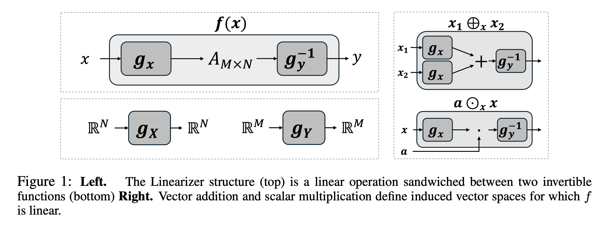

# Who Said Neural Networks Aren't Linear? The Linearizer Framework
This repository provides the code implementation for the paper [“Who Said Neural Networks Aren’t Linear?”]()
, which introduces the Linearizer Framework.
## Overview



Neural networks are famously **nonlinear**, but linearity is defined relative to vector spaces \(f: X → Y\).
This project introduces **Linearizers** - architectures that sandwich a linear operator \(A\) between two **invertible**
neural networks:
  
f(x) = g⁻¹ᵧ(Agₓ(x)).

This framework lets classic linear-algebra tools like **SVD**, **pseudoinverse**, and **projections**, operate on
 nonlinear mappings.

**Applications enabled by the framework and showed in the paper:**
- **One-Step Generation:** Reduce diffusion sampling from hundreds of steps to a single linearized step.
- **Style Transfer Interpolations:** Modular, controllable style transfer interpolations via linear 
transformations in the latent linear space.
- **IGN:** *Coming soon / TODO.*

We provide complete, runnable implementations for the listed applications in this repository.


## Project Structure

```
linearizer/
├── one_step/           # One-step generation application
│   ├── data/          # Data loading utilities
│   ├── modules/       # Core model components
│   ├── utils/         # Training and sampling utilities
│   ├── train_one_step.py
│   └── test_one_step.py
├── style_transfer/    # Style transfer application
│   ├── modules/       # Style transfer models
│   ├── utils/         # Visualization utilities
│   ├── train_style_transfer.py
│   └── style_intrepolations.py
├── ign/               # Coming Soon
└── common/           # Shared components
    └── song__unet.py # UNet architecture
```

## Installation Requirements

### Python Environment

1. **Create conda environment**:
   ```
   conda create -n linearizer python=3.9
   conda activate linearizer
   ```

2. **Install dependencies**:
   ```
   pip install -r requirements.txt
   ```

## Getting Started

Navigate to the specific application directories (`one_step/`, `ign/` or `style_transfer/`) for detailed usage instructions.
