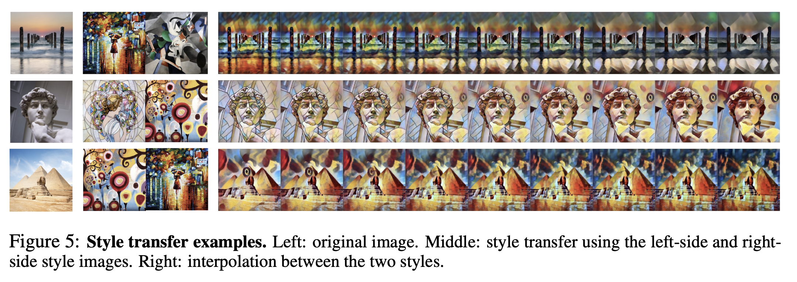

# Style Transfer Interpolation Application



## Overview

This application performs neural style-transfer interpolation using our Linearizer. It distills multiple styles from a pretrained style-transfer network into a set of linear operators defined over a shared, invertible latent space. For details on the interpolation procedure, please see our paper.


### Supported Styles

The system learns to generate these 4 artistic styles:
1. **Mosaic**: Mosaic-like artistic pattern
2. **Candy**: Colorful, vibrant style
3. **Rain Princess**: Impressionist painting style  
4. **Udnie**: Abstract artistic style


## Data Preparation
You can either use your own image, or use the images used in the paper.

### Run on Our Sample Images

Use one of the provided sample images in the `our_images/` directory:

```
python prepare_new_image.py \
    --image_path our_images/sample_image.jpg \
    --height 256 \
    --width 256
```

This will:
1. Resize the image to 256x256
2. Download style transfer models (if not already present)
3. Generate 4 styled versions: mosaic, candy, rain_princess, udnie
4. Save all images in the current directory

For example
```
--image_path your/path/to/our_images/david_256x256.png
-- height 256
-- width 256
```

### Run on Your Own Image

Upload your own image and generate styled versions:

```
python prepare_new_image.py \
    --image_path /path/to/your/image.jpg \
    --height 256 \
    --width 256
```

This will generate the images needed for next step(training).

## Training a Model
Now you are ready for training !

### Run Training

```
python train_style_transfer.py \
    --path_to_images your_image_folder \
    --img_resolution 256
```

Taking the example from the data generation step
```
--path_to_images your/path/to/our_images/david_256x256
--img_resolution 256
```


### Training Parameters

- `--path_to_images`: Path to directory containing original and styled images, this is the output folder from
- last data generation step.
- `--img_resolution`: Image resolution (default: 256)

### Training Process

The training will:
1. Load the original image and 4 styled versions
2. Display the input data for verification
3. Train the linearizer for 2000 epochs
4. Save the trained model to `outputs/{timestamp}/model.pth`
5. Generate and display style transitions

## Style Interpolation

After training, generate smooth interpolations between different styles:

```
python style_intrepolations.py \
    --model_path outputs/your_model/model.pth \
    --image_path path/to/input/image.png \
    --img_size 256 \
    --output_dir interpolation_results
```

### Interpolation Parameters

- `--model_path`: Path to trained model file
- `--image_path`: Path to input image for style interpolation
- `--img_size`: Image size (should match training resolution)
- `--output_dir`: Directory to save interpolation results

### What the Interpolation Script Does

1. **Loads the trained model** and input image
2. **Generates 6 interpolation sequences** between all style pairs:
   - Mosaic ↔ Candy
   - Mosaic ↔ Rain Princess  
   - Mosaic ↔ Udnie
   - Candy ↔ Rain Princess
   - Candy ↔ Udnie
   - Rain Princess ↔ Udnie

3. **Creates smooth transitions** with 9 intermediate steps between each style pair
4. **Plot and Saves results** as PDF files in the output directory

### Expected Outputs

- `interpolation_mosaic_candy.pdf`: Interpolation between mosaic and candy styles
- `interpolation_mosaic_rain_princess.pdf`: Interpolation between mosaic and rain princess styles
- And 4 more interpolation PDFs for other style pairs
